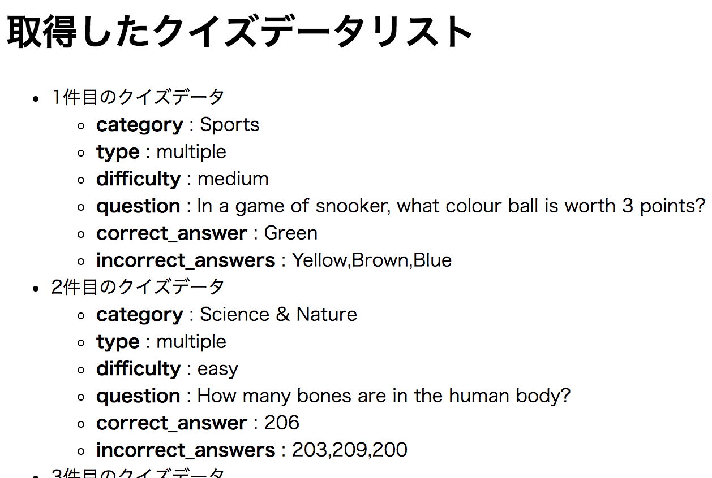

# レポジトリ内容

このレポジトリは[Web白熱教室](https://tsuyopon.xyz/)の[JavaScriptの学習コンテンツ > JavaScriptフロントエンド編](https://tsuyopon.xyz/learning-contents/web-dev/javascript/frontend/)にある「[【エクササイズ】fetchで取得したクイズデータを一覧表示する【JavaScript】](https://tsuyopon.xyz/learning-contents/web-dev/javascript/frontend/js-excercise-for-frontend-7/)」で利用するものです。

### 完成形(表示内容はリロードする度に変わる)

## 課題

以下の「課題をクリアするためのステップ」の内容を全て対応して、`index.html`をブラウザで開き、上の完成形の画像と同じような機能を実装する。(API(ネットワーク)経由でのデータの取得が完了されるまではクイズデータの表示はされないことに注意する。)

### 課題をクリアするためのステップ

1. [ ] main.jsの中のコメントに記述されている課題をクリアしてください。

## 答え

- 答えは `answer.html`, `answer.js` の中身になります。参考記事を読んでもわからなくなった場合は、答えの実装を見て、コードの流れを理解してからまたチャレンジしてみてください。(コピペ厳禁)

## 参考記事

課題をこなしていて、行き詰まったら以下の資料を参考にしていただければ解答にたどり着けるかと思います。

- Web白熱教室
  - [【JavaScript】fetchを使って外部データを取得する](https://tsuyopon.xyz/learning-contents/web-dev/javascript/frontend/how-to-use-the-fetch-api-in-js/)
  - [JavaScriptで新規作成したDOMを別のDOMに追加する](https://tsuyopon.xyz/learning-contents/web-dev/javascript/frontend/how-to-create-an-dom-and-append-child/)
  - [【JavaScript】DOMのテキスト内容を取得・変更する](https://tsuyopon.xyz/learning-contents/web-dev/javascript/frontend/how-to-manipulate-text-in-dom/)